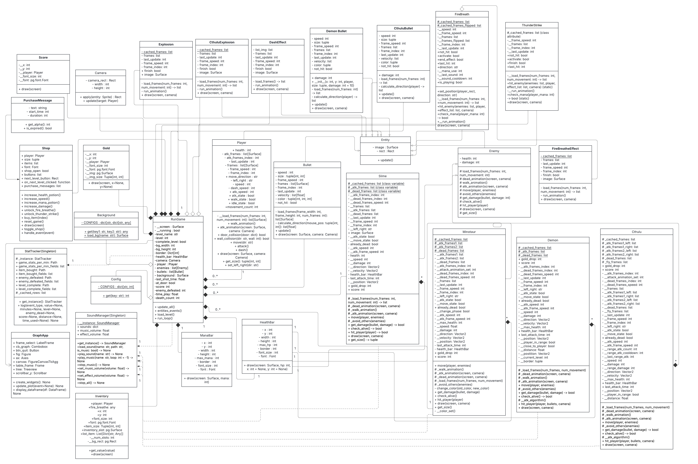

# 1.Project Overview
This is an endless 2D action-adventure game by using Pygame to develop.
Players need to complete multiple levels, shooting enemies, using skills, collecting gold, and buying items from the shop.
Enemies will be stronger when level is higher. 
Players can use money that they get from shooting enemies to buy a weapon or upgrade it to make it easier to kill enemies.

# 2.Project Review
This game is 2D action game that has gameplay like “Soul Knight”. This game also has enemies and boss that hard to defeat and have combat moves that depends on player action

# 3.Programming Development
## 3.1 Game Concept
- Players must clear levels by fighting enemies and defeating a boss that can predict the player's movement.

- Movement: walking, dashing

- Combat system: Shooting, Using magic skills, and special abilities

- Enemies: Different enemies types that have different behaviours

- Shop and power-ups: Can buy items from shops

- Stat tracking: tracking score, time, items, and enemy defeated

## 3.2  Object-Oriented Programming Implementation

### 1.Class Player:
-Represents the main character.

-Handles movement, attack animation, dash, collision, potion use, skill cooldown, and rendering.

### 2.Class Enemy: 
-Abstract class for all enemies.

### 3.Class Demon(Enemy): 
-A ranged enemy that shoots bullets toward the player.

### 4.Class Cthulu(Enemy):
-Boss enemy with both melee and ranged attacks.

### 5.Class Slime(Enemy):
-Normal enemy that has only melee attack.

### 6.Class Minotaur(Enemy):
-Enemy that has only melee attacks but it will be stronger when hp is low.

### 7.Class Explosion:
-Displays explosion animation when a bullet hits.

### 8.Class CthuluExplosion(Explosion):
-CthuluExplosion inherits from Explosion and overrides animation frames.

### 9.Class Bullet, Class DemonBullet, Class CthuluBullet:
-Represents bullets from player and enemies.

### 10.Class Shop:
-UI for purchasing items between levels.

### 11.Class PurchaseMessage:
-Represents temporary floating messages when purchasing items in shop (e.g., "Purchased", "Not enough gold").

### 12.Class SoundManager (Singleton):
-Central manager for all sound and music in the game.

### 13.Class HealthBar:
-Renders health bars for players and enemies.

### 14.Class Background:
-Loads and provides access to map layout, doors, and level border.

### 15.Class Camera:
-Handles camera tracking, centering on the player.

### 16.Class Run_game:
-Main game loop controller.
-Handles initialization, event processing, game states, and level transitions.

### 17.Class SoundManager:
-Manage a sound that use in the game

### 18.Class StatTracker:
-Collect statistics and save it to csv file

### 19.Class GraphApp
-show statistics

### 20.Class FireBreath
-use fire breath skill

### 21.Class ThunderStrike
-use thunder strike skill

### 22.Class ManaBar:
-Renders mana bars for players.

### 23.Class Gold
-Renders Gold

### 23.Class Score
-Renders Score

### 23.Class Inventory
-Renders Inventory

## UML Diagram

[UML_Link](https://lucid.app/lucidchart/4d0d02c8-7a70-41a0-a514-ec49460c037e/edit?viewport_loc=-5586%2C-1261%2C12619%2C5246%2CHWEp-vi-RSFO&invitationId=inv_721849d6-78e0-4955-99e8-566e74bfdfb5)

## 3.3 Algorithms Involved
-Collision: if players collide with enemies, players will lose HP

-Enemies behaviour: enemies will track the player location then move in a straight line to the player(using Pythagorean theorem).

-Boss behaviour: Boss will track the player's behaviour.

For example:

- if players use skills that they can’t move for a while the boss will use skill to attack players

-Event Driven: Keypress handling movement and attack

-Randomization: enemies randomly spawn

# 4.Statistical Data (Prop Stats)
## 4.1 Data Features
1.Player movements: distance that move
2.Buy count: count items that player buy
3.Time: Time that spent in level
4.Enemy interact: Enemies that defeated, amount of attack that hit them
5.Score: level that complete, scores

## 4.2 Data Recording Method
The data will be stored in the CSV file.

## 4.3 Data Analysis Report
-Use graph to show death count, scores, and enemy interact compare to time taken
-Use table to show numbers of items that player collected and player movement

|                               | Why is it good to have this data? What can it be used for                      | How will you obtain 50 values of this feature data | Which variable and which class will you collect this from?            | How will you display this feature data (via summarization statistics or via graph)? |
|-------------------------------|--------------------------------------------------------------------------------|----------------------------------------------------|-----------------------------------------------------------------------|-------------------------------------------------------------------------------------|
| Player movements              | To know that distance in levels is short or long to reach new level            | Collect total movement every 1 minute           | movement_count variable in Player class                               | Using Table                                                                         |
| Enemy defeated every 1 minute | To balance a game and know that enemy should be stronger or not                | Collect total enemy defeated every 1 minute        | enemy_defeated variable in RunGame class                              | Bar graph                                                                           |
| Score every 1 minute          | To balance a game and can compare score with other players                     | Collect score that player get every 1 minute       | score variable in RunGame class                                       | Boxplot                                                                             |
| Item that player buy          | To make items in game have balance and know what items should be adjust        | Collect when player buy items                      | bought_list in shop class                                             | Using histogram                                                                     |
| Enemy type that defeated      | To balance a game and know that  which type of enemy should be stronger or not | Collect when enemy get defeated                    | enemy_defeated_type in RunGame class                                  | Pie chart                                                                           |
| Time that use in level        | To balance a time that use in level                                            | Collect when player complete each level            | level_completed dict in RunGame class. key is level and value is time | Table                                                                               |
| Level that player complete    | To know that which level is hard                                               | Collect when player complete each level            | level_completed dict in RunGame class. key is level and value is time | Line graph                                                                          |

## Table

| Minutes | Level complete | Mean of enemy defeated every 1 minutes | Mean of score every 1 minutes | Amount Item that player buy in that round | Mean of  player movement every 1 minute |
|---------|----------------|----------------------------------------|-------------------------------|-------------------------------------------|-----------------------------------------|
| 1       |                |                                        |                               |                                           |                                         |
| 2       |                |                                        |                               |                                           |                                         |

## Graphs
|         | Feature Name                        | Graph Objective                                       | Graph Type | X-axis                       | Y-axis                            |
|---------|-------------------------------------|-------------------------------------------------------|------------|------------------------------|-----------------------------------|
| Graph 1 | Type of enemy that defeated portion | To show that player defeated what enemy the most      | Pie chart  | None                         | None                              |
| Graph 2 | Enemy Defeated Per minute           | To analyze the trend of enemy defeat rate over time   | Bar Graph  | Time (1 minute intervals)    | Number of Enemies Defeated        |
| Graph 3 | Level that player complete          | To show how far players progressed in the game        | Line graph | levels                       | Frequency of player that complete |
| Graph 4 | Score  that get in 1  minute        | To show that how much score do player get in 1 minute | Box plot   | Score  that get in 1  minute | None                              |
| Graph 5 | Items Purchased by Players          | To show that which items purchased by Players         | Histogram  | Items that player purchased  | frequency                         |

# 5. Project Timeline
| Week         | Task                                                                                                                 |
|--------------|----------------------------------------------------------------------------------------------------------------------|
| 1 (10 March) | Proposal submission / Project initiation                                                                             |
| 2 (17 March) | Full proposal submission / implemented the shooting system, enemy movement, player movement, and  player animations. |
| 3 (24 March) | Implemented the level system, boss mechanics, various type of enemy                                                  |
| 4 (31 March) | Graphics and Audio Implementation / UI/UX implementations                                                            |
| 5 (7 April)  | Improve enemy behaviour / testing and debugs                                                                         |
| 6 (14 April) | Submission week (Draft) / Improve game balance                                                                       |

| 26 March-2 April  | Implement shop/ Implement Magic spells                                        |
|-------------------|-------------------------------------------------------------------------------|
| 3 April-9 April   | Graphics and Audio Implementation / UI/UX implementations                     |
| 10 April-16 April | Improve enemy behaviour / testing and debugs / finish all gameplay for a game |
| 17 April-23 April | Balancing a game / Collecting data                                            |
| 24 April-11 May   | Data analysis and report                                                      |

List 50% of the tasks that you expect to complete by 16 April.
All game feature should be finish  
List 75% of the tasks that you expect to complete by 23 April.
Balancing a game and collect data
List the remaining 25%
Data analysis and report

# 6. Document version
Version: 5.0
Date: 11 May 2025

# 7. Project Video
[Youtube](https://youtu.be/QJsO0zhgS38?si=LAQ79cyKAei1jSHd)

